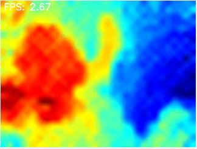
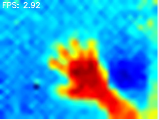

## MLX90640 Thermal Image Sensor for RPi4

### Developer : GH
### E-Mail : lsirikh@naver.com
### Release : 2024-09-24

#### Using MLX90640 with RPI4 via I2C for Visualization 

You can acquire data from MLX90640 through I2C on RPI4.  

1. python based project with seeed_mlx9064x lib.
2. Visualization using OpenCV with colored mapping.  

Sample image is located at `/pics/example.png`.

